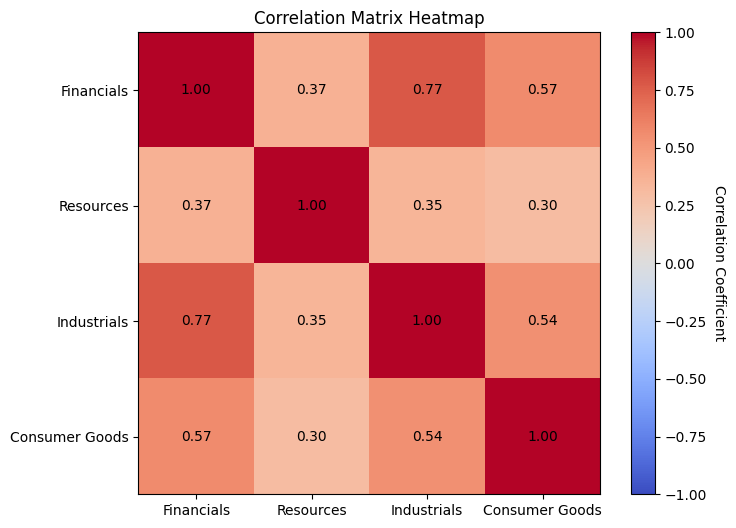
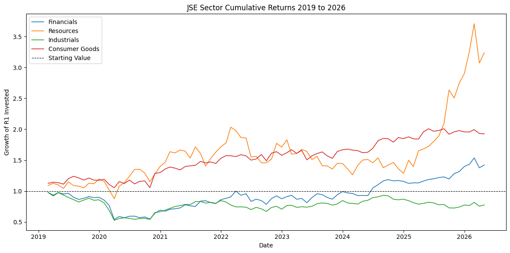
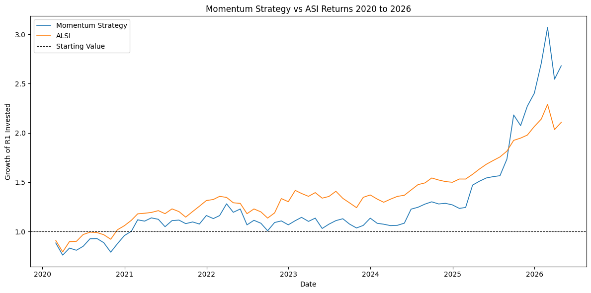

# JSE Sector Momentum Strategy
## A Quantitative Analysis of Sector Rotation on the Johannesburg Stock Exchange

**Author:** Tatenda Maswedza  
**Date:** April 2026  
**Contact:** tmaswedza@gmail.com  
**LinkedIn:** linkedin.com/in/tatenda-maswedza  

## Executive Summary

The JSE is known to exhibit momentum, and using the 12-1 momentum strategy on data from 2019 to 2026, the strategy produced an annual return of 15.78%, outperforming the ALSI which returned 11.93%. However, these returns came with extra risk in terms of both drawdowns and volatility. The strategy was also unstable — it underperformed the ALSI for four years and only surpassed it in late 2025, driven by sustained momentum in the Resources sector. The Sharpe ratio of 0.63 versus 0.72 for the ALSI confirms that on a risk-adjusted basis the strategy added no value over the benchmark. Two improvements are identified: a cash filter to exit the market when momentum is absent, and an investigation into shorter momentum timeframes for periods where sustained momentum is brief. The strategy falls short of the ALSI on a risk-adjusted basis, but the underlying momentum edge is real and warrants further development.

---

## Introduction

Since the revelations of Jegadeesh and Titman in their 1993 paper, "Returns to Buying Winners and Selling Losers: Implications for Stock Market Efficiency", the world received rigorous proof that markets are not as efficient as general market efficiency theory suggests — winners continue to do well for extended periods. The JSE, being a well-developed market but with generally lower liquidity than other major exchanges, provides a basis for expecting stronger momentum effects, and multiple studies have confirmed that momentum exists on the JSE. However, like all strategies, momentum tends to lose its edge over time as it becomes widely adopted. This research tests whether the 12-1 momentum strategy — the gold standard in momentum research — still holds an edge on the JSE using the most recent available data.

### Research Question
Does the 12-1 momentum strategy produce superior returns compared to the ALSI benchmark, in terms of both annualised returns and risk-adjusted returns?

## Data

Daily index data were collected for five JSE indices — the All Share Index (ALSI), Financials, Resources, Industrials, and Consumer Goods — covering the period January 2019 to April 2026, sourced from Yahoo Finance via the yfinance library. The Property index was excluded due to unavailability on Yahoo Finance.

Two data quality issues were identified and corrected. First, the Financials index had 20 consecutive missing trading days from 23 March to 21 April 2021, likely due to a Yahoo Finance data gap rather than a real market event. This was resolved by downloading the missing data from Investing.com, cleaning the formatting, and inserting it into the main dataset. Second, both the ALSI and Consumer Goods index contained single-day data errors — near-zero values that represented bad ticks rather than real market moves. These were corrected using linear interpolation from the surrounding trading days.

Daily prices were resampled to month-end closing prices and converted to log returns. Monthly data was preferred over daily data to reduce noise and match the rebalancing frequency of the strategy — a sector rotation strategy that rebalances monthly does not benefit from daily granularity in the signal construction.

---

## Methodology

The central methodology tested a 12-1 momentum strategy, which involves computing the total monthly log returns over the past 11 months, excluding the most recent month, such that the 11-month window becomes the predictor for the following month. The most recent month is excluded due to the short-term reversal effect — when an asset has a strong return in the most recent month it tends to give back some of that gain in the subsequent period, which would introduce noise into the signal. Once the momentum score is calculated, the four sector indices are ranked from highest to lowest, and the index with the highest momentum score is selected as the investment for the following month.

The signal and rankings are calculated on a rolling monthly basis. At the end of each month the previous position is exited and the new highest-ranked sector is entered. A one-month execution lag is applied throughout — the signal generated at the end of month T uses only data available before month T+1, ensuring no lookahead bias is introduced into the backtest. Performance was evaluated using four metrics: annualised return, annualised volatility, Sharpe ratio, and maximum drawdown, all compared against the ALSI as the passive benchmark.

---

## Results

### Exploratory Data Analysis

Overall the indices all had a positive rate of return except for Industrials, which had an average annualised return of -3.51% over the study period. Resources had the highest annualised return of 16.21%, followed by the ALSI itself which had a return of 11.93%, whilst Consumer Goods and Financials had annualised returns of 9.04% and 4.86% respectively. On the risk side, Resources had the highest volatility of 29.32%. It was also interesting to note that all indices had a lower Sharpe ratio than the ALSI which had 0.72. Consumer Goods had the highest risk-adjusted return of 0.60, followed by Resources (0.55), Financials (0.21), and Industrials (-0.18). Ordinarily we should not invest in Industrials since the expected return is negative, but for the momentum cycle strategy the logic is that we may find times where we can ride the momentum and earn a return even if the asset itself is overall unprofitable. The table below shows more detail:

#### Indices Risk and Return Profile
| Sector | Annual Return | Annual Volatility | Sharpe Ratio |
|---|---|---|---|
| Financials | 4.86% | 23.02% | 0.21 |
| Resources | 16.21% | 29.32% | 0.55 |
| Industrials | -3.51% | 18.98% | -0.18 |
| Consumer Goods | 9.04% | 15.12% | 0.60 |
| **ALSI** | **11.93%** | **16.50%** | **0.72** |

### Return Distribution

The Financials distribution is slightly concentrated around zero but has a pronounced left tail, with a few extreme negative returns exceeding -30%. The downside risk is asymmetric — most months are unremarkable but occasional severe crashes are a feature of this sector.

The Resources distribution is flat with fat tails on both sides. The bulk of the distribution is positive so positive returns are more frequent, but the flatness shows that month-to-month returns are highly unpredictable. The tails are wide but consistent, falling within a range of approximately ±20%, which demonstrates that the risk in Resources is high but priceable.

Industrials have the bulk of returns concentrated within ±10%, so most months are uneventful. However there are extreme values on both sides — the negative extremes likely reflecting the COVID crash and structural sector decline, the positive extreme reflecting the post-COVID recovery bounce.

Consumer Goods has the closest to a normally distributed return profile, though it is slightly skewed to the right with some extreme positive returns near 20%, while negative returns remain below 10%. This shape is consistent with the earlier finding that Consumer Goods has the best overall risk-adjusted return of the four sectors.

### Correlation

Resources generally have a lower correlation with all other sectors, ranging from 30% to 37%, with its correlation with Consumer Goods being the lowest at 30%. This is likely because the Resources sector is essentially driven by global commodity prices, which are separate from the internal economic performance of South Africa.

Industrials and Financials have the highest correlation of 77%, which is expected because industry is the biggest customer of the finance industry and the opposite is also true.

Overall the correlations range from 30% to 77%, which means there is scope for rotation, with the pairs below 50% presenting a bigger opportunity and the 50% to 80% range offering a moderate opportunity.

### Cumulative Returns

Overall performance of the indices is below:

### Strategy Performance

The cumulative return below shows how the strategy performed against the ALSI:

The momentum strategy produced an annual return of 15.78% against the ALSI which returned 11.93% over the same period, representing 3.85% excess return over the benchmark.

At face value the strategy's returns are superior, however they came at a volatility of 24.88% compared to 16.50% for the ALSI. This means it took an extra 8.38% in volatility and 5.09% more maximum drawdown to generate the extra 3.85% return, which demonstrates that the strategy introduced more risk than it brought return. The Sharpe ratio confirms this — 0.63 for the strategy versus 0.72 for the ALSI.

The strategy did not perform well from 2020 to 2025 and only surpassed the ALSI in late 2025. During the COVID crash the strategy fell slightly more than the ALSI, demonstrating the well-known characteristic that momentum strategies struggle when all assets move in the same direction. When recovery came in late 2020 into 2022 the strategy also recovered, but once that momentum died the strategy started to underperform again. The cumulative return picture shows that unless there is sustained momentum in the market the strategy does poorly, and it was the commodity boom starting in 2024 that drove the late outperformance.

The strategy would suit an investor willing to endure long periods of underperformance before recovering once the market develops sustained momentum. It is worth noting that Resources as a standalone index outperformed the strategy significantly — suggesting the rotation mechanism added complexity without proportional reward during this period.

The strategy also lacks a mechanism to exit the market when momentum is too weak across all sectors. Adding a cash filter is a logical improvement, however the timing paradox remains — by the time momentum is observed it may already be fading.

---

## Conclusion

The strategy produced a better annualised return of 15.78% against the ALSI which returned 11.93% over the study period. However, on a risk-adjusted basis the ALSI was better, producing a Sharpe ratio of 0.72 against the strategy's 0.63. With this we cannot conclusively conclude that the 12-1 momentum strategy had superior returns, because at face value the return is higher but once adjusted for risk it is less. Using the risk-adjusted return, which is a better measure since it accounts for risk, we take the more prudent view that the strategy is not superior.

The strategy's biggest flaw is that it performs poorly when the market is doing badly, because everything moves in one direction — the COVID crisis is a classic example where the strategy drawdown was bigger than the ALSI. Compounding this problem is that the strategy also rides negative momentum, which undermines the basic logic of momentum investing. Solving this will be a challenge because one alternative is to include a cash strategy, however there is a risk that the strategy may be late in re-entering the market, as strategies that exit usually fail to capture momentum when it returns.

The strategy requires a sustained level of momentum to eventually benefit — short-term momentum is wiped away by the averaging of the 11-month window. For this specific problem it would have been interesting to optimise the lookback window or the skip period, as this may help address the challenge. The monthly returns also work well for sustained momentum, which unfortunately is intermittent, therefore exploring shorter-term momentum timeframes is also an opportunity.

The strategy proves that momentum has potential on the JSE — the base model of the 12-1 momentum strategy produced acceptable returns. This answers the first stage of the analysis and the answer is a green light for further exploration. The JSE indeed has momentum and the 12-1 strategy produces acceptable returns. The next step will be to optimise or add confirmations and filters, which can then move the strategy from acceptable returns to superior returns.

---

## References

Jegadeesh, N. and Titman, S. (1993). Returns to Buying Winners and Selling Losers: Implications for Stock Market Efficiency. *Journal of Finance*, 48(1), 65–91.

Data sourced from Yahoo Finance via yfinance and Investing.com.

---

## Appendix

**GitHub Repository:** [To be added after publishing]

**Tools Used:**
- Python 3.13.7
- pandas 3.0.2
- numpy
- matplotlib
- yfinance 1.2.1

**Notebooks:**
- 01_alsi_data_collection_cleaning.ipynb
- 02_sector_data_collection_cleaning.ipynb
- 03_exploratory_analysis.ipynb
- 04_signal_construction.ipynb
- 05_backtesting.ipynb

